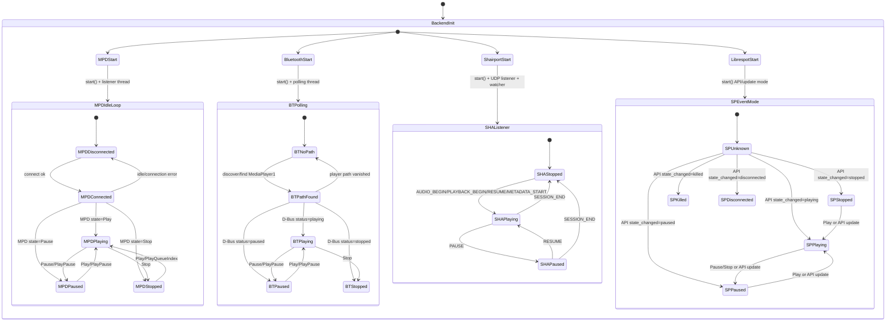
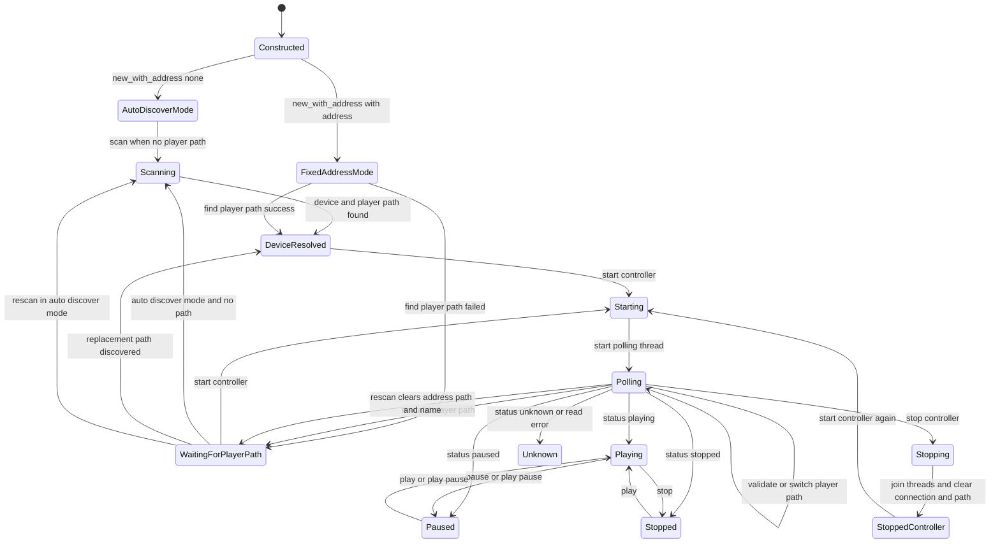
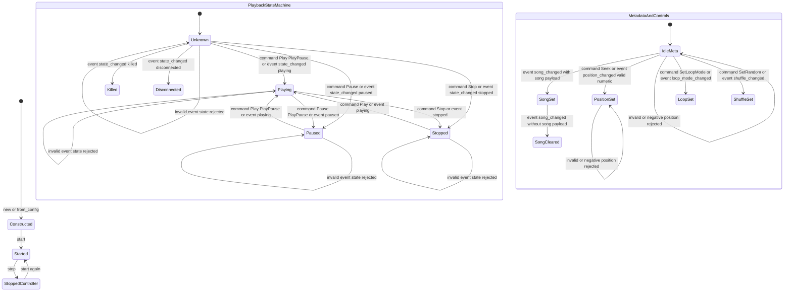

# Controller State Machines

This document describes the runtime state machines for player orchestration and service startup/shutdown in AudioControl.

## Global Controller and Service State Machine

### What this means

- All configured players are started. There is one active selector (`active_index`) in `AudioController`.
- Commands routed through `AudioController` (`send_command`) target only the current active player.
- Active player selection is updated by `ActiveMonitor` when a player emits `StateChanged(Playing)`.
- On `StateChanged(Playing)`, `ActiveMonitor` also enforces single-playback by pausing (or stopping if pause is unavailable) other players that are currently `Playing`.
- A successful active switch publishes `ActivePlayerChanged` on the global event bus.
- API endpoints `pause-all`/`stop-all` intentionally target all players (with optional exclusion).

### Exclusivity vs collisions

- Active selection is exclusive: only one `active_index` exists at a time.
- Playback is enforced to be single-source: at most one player should remain in `Playing` after `StateChanged(Playing)` handling completes.
- Allowed idle behavior remains unchanged: zero players in `Playing` is valid.
- Collision behavior: if multiple players emit `Playing` close together, last processed event decides active focus, and non-source players are paused/stopped where capability support allows.

## Backend-Specific Player State Machine (MPD, Bluetooth, Shairport, Librespot)

### Notes by backend

- MPD: event listener thread updates state from MPD idle/status; reconnect logic moves between disconnected and connected states.
- Bluetooth: polling thread maps BlueZ `Status` to playback state; auto-discovery/path switching can transition to and from "no path".
- Shairport: UDP control messages define transitions explicitly (`PAUSE`, `RESUME`, `AUDIO_BEGIN`, `SESSION_END`).
- Librespot: state is primarily event-driven via incoming API events; commands use Spotify API when token is valid.

## Bluetooth Controller Runtime State Machine Details

### Notes on behavior

- Stale player-path handling is explicit: invalid path transitions now clear to no-path when no replacement is found.
- Auto-discover restart and rescan behavior now keys off missing player path in auto-discover mode, so rediscovery can continue after path loss.

## Generic Controller State Machine Details

### Current behavior notes

- Command and API-event paths are now aligned for state/loop/shuffle/position transitions: both update local state and emit corresponding notifications.
- Invalid state_changed strings are rejected and do not force a transition to Unknown.
- Seek and position_changed reject invalid numeric input (non-finite or negative values).
- PlayPause is implemented and included in default generic capabilities.
- Lifecycle transitions remain intentionally shallow: start and stop do not force playback-state changes.

## Practical conclusion

- The system has one active player pointer and now actively enforces one playback source.
- Temporary overlap can still occur during backend event races, but `ActiveMonitor` converges to at most one `Playing` player by pausing/stopping others as events are processed.
