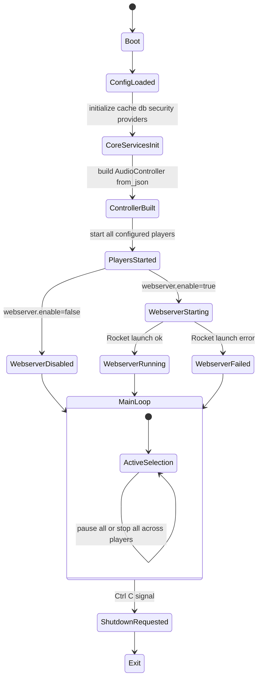
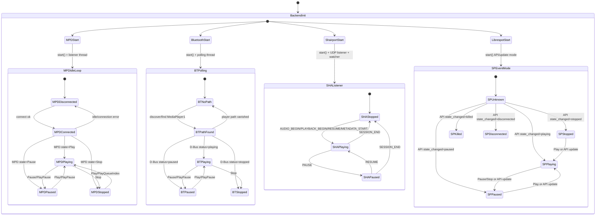
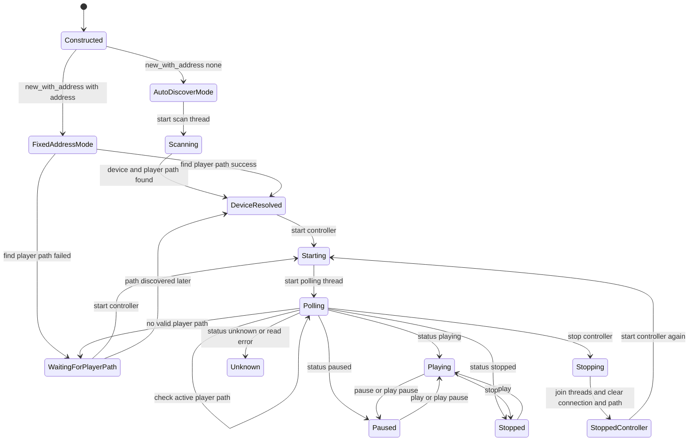

# Controller State Machines

This document describes the runtime state machines for player orchestration and service startup/shutdown in AudioControl.

## 1) Global Controller and Service State Machine

### What this means

- All configured players are started. There is one active selector (`active_index`) in `AudioController`.
- Commands routed through `AudioController` (`send_command`) target only the current active player.
- Active player selection is updated by `ActiveMonitor` when a player emits `StateChanged(Playing)`, with a 500ms debounce to reduce flapping.
- A successful active switch publishes `ActivePlayerChanged` on the global event bus.
- API endpoints `pause-all`/`stop-all` intentionally target all players (with optional exclusion).

### Exclusivity vs collisions

- Active selection is exclusive: only one `active_index` exists at a time.
- Playback is not exclusive: multiple players can be in `Playing` simultaneously.
- Collision behavior: if multiple players emit `Playing` close together inside the debounce window, later events are ignored; outside the window, event order still decides which one ends up active.

## 2) Backend-Specific Player State Machine (MPD, Bluetooth, Shairport, Librespot)

### Notes by backend

- MPD: event listener thread updates state from MPD idle/status; reconnect logic moves between disconnected and connected states.
- Bluetooth: polling thread maps BlueZ `Status` to playback state; auto-discovery/path switching can transition to and from "no path".
- Shairport: UDP control messages define transitions explicitly (`PAUSE`, `RESUME`, `AUDIO_BEGIN`, `SESSION_END`).
- Librespot: state is primarily event-driven via incoming API events; commands use Spotify API when token is valid.

## 3) Bluetooth Controller Runtime State Machine (Current Code)

### Potential inconsistent states or transitions

- Stale player-path transition: when the stored player path disappears, the code logs and searches for a new path but does not clear the old path immediately on failure. This can keep the controller in a stale "path exists" branch instead of transitioning cleanly to "no path".
- Duration unit inconsistency: one track parsing path converts `Duration` using microseconds to seconds (`/ 1_000_000.0`), while polling track parsing converts with milliseconds to seconds (`/ 1000.0`). That can create inconsistent song duration state depending on call path.
- Auto-discover rediscovery gap on restart: after auto-discover resolves a concrete address once, restart logic only re-enables scanning when address is none. If that remembered address is no longer available, transitions to rediscover a different device are limited.

## Practical conclusion

- The system has one active player pointer, not one active playback source.
- Therefore, collisions are possible in practice: simultaneous playback can occur, while active control focus remains singular and now has anti-flap protection through switch debounce.
